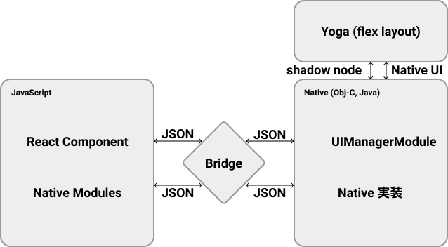

この記事は [Meguro.es #25](meguro-es) で登壇した内容です。

## はじめに

最近 [React Native Community](react-native-community) の Github org の一員となりました。Community の一員になれた経緯はまた別の記事で書こうと思います。Community の一員として Contributors の Discord channel に招待されて、色々な知見が手に入るので、今回はその一部をシェアします。

## The New React Native 

2020年は React Native が大きく変わる年になります。現在、React Native は内部設計を徐々に変更しています。この内部設計の変化については、React Native Re-architecture として2018年からいくつかの技術カンファレンスにて発表がありました。

[The New React Native - React Native EU](https://www.youtube.com/watch?v=52El0EUI6D0)
[React Native: the Past, the Present and the Future - React Advanced](https://www.youtube.com/watch?v=7gm0owyO8HU)

この記事ではその Re-architecture について、自分の理解を共有します。

## いままでの設計

今まで内部的にどう動いていたのかについて、説明します。React Native はその名の通り、React で View の部分を作成するクロスプラットフォームのフレームワークです。ですが、JavaScript で書かれている React を iOS や Android にそのまま表示させることはできません。また、iOS や Android のモバイル端末には Bluetooth や位置情報機能など、端末に備わっているネイティブ機能があります。JavaScript だけでモバイルアプリがかけるプラットフォームである以上、ネイティブ機能も JavaScript から呼び出せる必要があります。React Native では、React で書かれた見た目や JavaScript で書かれたメソッド呼び出しをネイティブ側とつなぐために Bridge と呼ばれる中間層がありました。

Bridge 間の通信は JSON を通じて行われます。JavaScript のコードもネイティブ側のコードも JSON を通じて非同期的に通信を行います。
ネイティブ側では UIModuleManager というモジュールが UI を描画します。React Native の View は FlexBox レイアウトで描かれますが、ネイティブ側には FlexBox レイアウトの知識がありません。そこで、Yoga と言う Facebook 製のレイアウトエンジンを使って受け取った Style の情報を処理して、その情報を UIModuleManager に渡します。ネイティブ機能の呼び出しもまた JavaScript から Bridge を通して非同期的にネイティブコードを呼び出す作りになっています。

React Native は長い間この設計で動いていました。JavaScript と ネイティブ側のコードが Bridge を挟んでお互いへの関心なく動作していました。しかし、この設計には問題がありました。Bridge 間のすべての通信は非同期で行われるため、ネイティブ側のコードはいつコードが呼ばれても良いように、すべての Module を起動時に読み込む必要があります。また、Bridge は一つしか無いので、非常に多くの処理を行っている時、ボトルネックになり得ます。View の部分も、一度 UIModuleManager が JSON を受け取ってからそれを Yoga に持っていき、処理されたものを扱う必要があったため、コストがかかっていました。

これらの問題を解決するために、React Native Re-architecture がはじまりました。

## React Native Re-architecture

React Native の新しい設計は５つの段階に分けて行われています。

- JSI
- TurboModule (Native Moduleの改善)
- React Native Fabric (View Renderの改善)
- CodeGen
- Removal of Bridge (アプリ起動時間の改善)

## JSI

JSI とは JavaScript Interface の略で、Facebook が作成している JavaScript Engine をラップするレイヤー層です。React Native は従来 WebKit で使われている JSC という JavaScript Engine が使われてきました。他の JavaScript Engine の例としては Chrome や Node で JS 動かすのに使われている Google の V8 が挙げられます。JSI の誕生によって、React Native では内部で使用する JavaScript Engine を選べるようになりました。

React Native を V8 で動かす [react-native-v8](https://github.com/Kudo/react-native-v8) というライブラリもあります。

また、Facebook はより軽量でスペックの低い端末でも快適に動かすための [Hermes](https://github.com/facebook/hermes) という新しい JavaScript Engine を独自で開発しています。

JSI はすでに大部分が実装されていて、React Native のコアリポジトリの中に実装があります。

また、JSI のもう一つの大きな特徴は、C++ のホストオブジェクトへの参照を持っており、C++ のメソッドをそのまま実行できると言うところにあります。これは、Bridge を使っていた時に問題になっていたすべての実行が非同期になってしまうことを解決するものとなります。

また、C++ は iOS と Android がそのまま使用できる数少ない言語となります。Android の Java のコードは JNI (Java Native Interface) を通して C++ に変換されて実行されています。iOS の Objective-C はその名の通り C++ と緩和性の良い言語なので、そのまま使うことができます。

C++ は他の多くのプラットフォームもサポートしている言語なので、iOS や Android にとどまらず、色んなプラットフォームに適応出来るようになります。Nintendo Switch のゲームが React Native で書ける未来もあるかもしれません。

## Turbo Modules

Turbo Modules は上記の JSI を使って、Bluetooth や位置情報などの端末のネイティブ機能の呼び出しを同期的に行っていく改善です。同期的に呼び出しが行えると言うことは、必要な時に呼び出しを行えば良いので、起動時にすべての modules を読み込む必要はなくなります。これでアプリの起動は劇的に早くなります。また、同期的に呼ばれることによって、その機能のパフォーマンスも改善します。

Turbo Modules はすでに React Native のコア部分に実装されているネイティブ機能においては実装されてています。
[react-native-ble-manager](https://github.com/innoveit/react-native-ble-manager) など、サードパーティが作成している Native Module に関してはまだ適応されていませんが、Turbo Modules の部分が OSS として切り離されたら、サードパーティの Native Modules も Turbo Modules が適応できるようになります。

## React Native Fabric

React Native Fabric は同じく JSI を使って、View の部分を更新を部分的に同期的に行う仕組みとなります。
この実装は、描画の優先順位を操作できる React Concurrent Mode によって実現可能となります。多くのアイテムがあるFlatListを高速でスクロールした時など、描画が優先されるべき状態において、適切な描画を行うようになります。
また、レイアウト部分を司る Yoga は C++ 製なので、C++ の呼び出しを直接行える JSI が間にあることによって、無駄な通信を減らし、パフォーマンスが改善されます。

React Native Fabric は React Concurrent Mode が本格的に使えるようになったら組み込まれるようになります。
実装は 2020年中旬を予定しています。

## CodeGen

Turbo Modules と React Native Fabric は両方 JSI を使うことが前提となっています。JSI は前述したとおり、C++ を直接呼び出せることによって高いパフォーマンスを出すことが出来るものです。C++ は静的型言語なので、これを実現するには型が必須となります。TypeScript や FlowType を使って、JS に型を付けて、C++ にも型を付けるとなると手間が大きいため、JS の型情報から C++ の型情報を作成する CodeGen と言うツールが作成されています。React Native は内部で FlowType を使っていますが、CodeGen は TypeScript の型にも適用可能となっています。FlowType の変換には FlowType の Parser、TypeScript の型には TypeScript の Parser を使って型を変換します。ただ、曖昧な型は C++ では許されないので、必然的に any を排除する必要が出てきます。

CodeGen のもう一つの使い方として、型の Diff を取ることによってアプリのアップデートが CodePush 可能かどうかを判別することができます。JS のコードの変化によって、Native の呼び出しへの型の変更が無ければ、CodePush のみでアップデートをかけられると判断することができます。

CodeGen のコードも今は React Native のコア部分に実装されています。これもまた、ツールとして切り出されると認識しています。

## Removal of the Bridge

内部の設計が Bridge から JSI に切り替わったら、いよいよ Bridge は取り除かれます。前述の通り、Bridge がある状態では、すべての Native Modules を事前に読み込む必要があるため、React Native のアプリの起動はネイティブアプリよりも時間がかかります。Bridge が取り除かれることによって、アプリの起動は劇的に早くなるでしょう。とはいえ、後方互換性も保つ為に、いきなり Bridge が消えるようなことはありません。コア部分の実装がすべて Bridge 無しで起動出来るように、そしてサードパーティの対応の時間も考慮すると、しばらく Bridge は残るでしょう。

Bridge の撤去作業は2020年後半に開始され、まだ少し時間が掛かりそうです。

## まとめ

2018年から言われ続けていた React Native の Re-architecture ですが、React の Concurrent Mode も実装されてくる中、2020年には大きな動きを見せてきています。JSI の登場によって、iOS や Android のより深いところに直接触りに行けるので、従来の iOS や Android アプリよりも一部パフォーマンスが出るようになることも夢では無いかもしれません。最近は Microsoft も [React Native Windows](https://github.com/microsoft/react-native-windows) に力を入れていたり React Native 自体の改善も積極的に行っています。Turbo Modules への移行などは自分も積極的に Contribute していくつもりです。React Native の今後の改善を楽しみにしていてください。

[meguro-es]:https://meguroes.connpass.com/event/159506/
[react-native-community]:https://github.com/react-native-community

