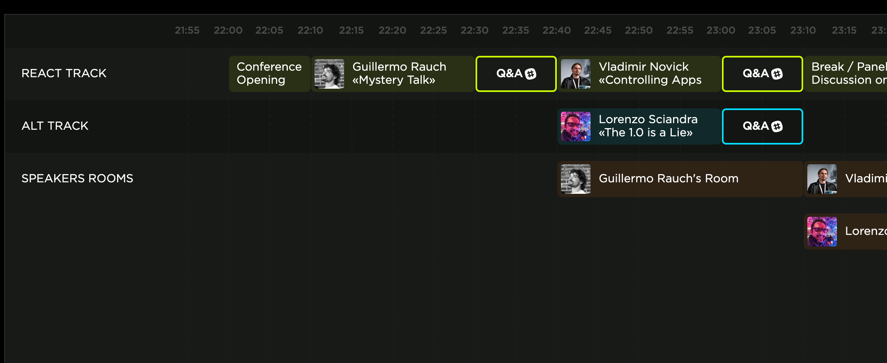

2020/04/17 に開催された [React Summit Remote Edition](https://remote.reactsummit.com/) を視聴していたのでそのレポートを書きます。
コロナウィルスが蔓延っているなか、登壇者、実況者、参加者すべてがリモートで参加する盛大なイベントとなりました。

YouTube Live で視聴するのみなら参加費は無料（！）で大変ありがたかったです。

有料枠では、登壇者に質問できる Slack チャンネルや、登壇者と直接 Zoom で対話できる枠、技術的な質問を自由に聞ける Workshop、懇親会にてオンラインバー、QuakeJS大会など、世界中の参加者と交流する枠などが用意されていました。

開催時間が日本時間の22:00-2:30で、質問する体力がでなさそうだったので、今回は無料枠で参加しました。

## React Summit とは

React Summit はその名の通り ReactJS の技術カンファレンスです。React や React Native のセッションが全体を占めており、Next.js の共同作成者である Guillermo Rauch氏や、海外のt_wadaとも言える Kent C. Dodds氏、React Native のリリースやコミュニティの運営に深く関わっていた Lorenzo Sciandra (Kelset) 氏など、界隈の有名人が多く集まっていました。

Main Track と Alt Track の 2 Track があり、Main Track は React についての話題、Alt Track は React Native の話題が多かったです。自分は React Native についてのセッションが聞きたかったので、主に Alt Track の方を聞いていました。

リモートでは部屋を切り替えるのに物理的な移動はいらず、YouTube Liveのリンクを切り替えるだけで済んだのはとても便利でした。

また、公式サイトでは時間に合わせてどのトラックでどういうトークやディスカッションが行われているかが簡単に可視化できるタイムラインが用意されており、とてもまとまっている印象を受けました。今後も行われていくであろうリモートカンファレンスの参考になるかもしれません。

## トークまとめ

各トークの概要やタイムテーブルなどは[公式サイト](https://remote.reactsummit.com/)に記載されています。

ツイッターでは [#ReactSummit](https://twitter.com/hashtag/ReactSummit) のハッシュタグで世界中の人が実況していました。

YouTube Live のリンクは残っているのでそこから視聴し直すこともできます。

- Main Track: https://www.youtube.com/watch?v=Wyk01ySxg0A
- Alt Track: https://www.youtube.com/watch?time_continue=5225&v=9l_N9BlF3bE

### Main Track: Keynote on Next.js and Serverless by Guillermo Rauch 14:40~

最初は Next.js の共同作成者である Guillermo Rauch氏の Keynote でした。

JAM Stack の概念の説明から JIT (Just In Time) ではなく AOT (Ahead Of Time) にページをビルドして届けることの重要性、それを可能とする Next.js 9 の紹介を行っていました。

Next.js を使ってサイトを作成することで、Code を Push した時に、それが即座に反映され、Pull Request の中でも Preview が見れるようになっています。

### Alt Track: The 1.0 is a Lie by Lorenzo Sciandra 3:31~

Alt Track の最初のトークは React Native のリリースや React Native Community の運営に深く関わっていた Lorenzo (Kelset)氏のトークです。

このトークでは React Native のリリースプロセスはどのようにして行っているのかについて説明していました。

React Native は Facebook が開発しているフレームワークですが、現在、新しいバージョンのリリースは自分も属している社外コミュニティである React Native Community が行っています。

React Native のリリースプロセスは一筋縄では行きません。
最近はフロントエンドの動きは落ち着いてきたと言われていますが、それでも常に動き続けてはいるので、React Native はそれに追従する必要があります。
最新の React を追うのに加えて、Android や iOS も毎年新しいバージョンがリリースされるため、それらに追従する必要もでてきます。

それに加えて、変更履歴を追えるようにするためのChange logの作成、新規機能に合わせたドキュメントの作成や、新機能をまとめたブログ記事など、React Nativeのコード外でも色々な準備が必要となります。

また、ユーザー側からしても、React Native のバージョンを上げるのは、単に package.json のバージョンを上げるだけでは済まないことが非常に多いため、そのバージョンを上げるプロセスを容易にする為に、[Upgrade-helper](https://react-native-community.github.io/upgrade-helper/) に diff を作成したりしています。

React Native のリリースプロセスについては [react-native-community/releases](https://github.com/react-native-community/releases) のリポジトリにも記載されています。

このトークでチラッと議題に上がったのは開発元である Facebook が React Native をどのように使っているかです。
Facebook は内部で独自の Monorepo を持っており、React Native はその中の一つです。内部で行われた変更が、Github上でも公開されている React Native のリポジトリにミラーリングされるようになっているようです。

トークタイトルの The 1.0 is a Lie についてですが、一般的に、ライブラリのバージョンは 1.0 を持って「安定」していると言うケースが多いです。

Facebook のライブラリは 0.x.x~ のものが多いです。ReactJSも長い間 0.15.x~ の状態でした。 0.15.x -> 16.x になっていましたね。

React Native は現在 v0.62 がstableとしてリリースされており、次の release candidate として v0.63-rc.0 が上がっている状態です。

では、React Native は「安定」していないのか？
React Native を Production で使うには 1.0 を待ったほうが良いのであろうか。

答えは NO です。

React Native は現在も多くのプロダクトで使われています、Microsoft, Amazon, Shopify, Blizzard, Sony, Coinbase など有名企業も使っています。

また、React Native 数年単位で行う Re-architecture も内部で行っています。

React Native のリリースプロセスに時間がかかるのは、常に動き続けると同時に、ユーザーが急な変更によって追われることが無いようにです。

React Native が 1.0.0 に到達するにはまだまだ時間がかかりそうですが、React Native を使うのにそれを待つ必要は全く無いと断言します。

### Alt Track: Lightning Talks ~49:02

次に、Alt Track では４つの LT がありました。それぞれの内容について軽く記載していきます。

#### Machine Learning on the Edge by Sangeeta KP

最初は Amazon のエンジニアである Sangeeta氏の LT です。

モバイルアプリで機械学習が行える [ML Kit](https://firebase.google.com/products/ml-kit?gclid=EAIaIQobChMI7M7U-_Hw6AIVEp_CCh34HgpIEAAYASAAEgIvOvD_BwE) の紹介と、それを React Native に組み込む方法について、説明していました。

MLKit は Google が提供している機械学習用の API であり、 Firebase と連携して使うことができます。
React Native には Firebase との連携が行える [React Native Firebase](https://rnfirebase.io/) があるので、それを使うことで、React Native のアプリでも機械学習を用いたアプリを作成することができます。

MLKit を使うことで顔面解析や自然言語解析など、様々なことが行えるようになります。

#### Styles and Theming with Restyle in React Native by Haris Mahmood

次に、Shopify のエンジニアである Haris氏の LT です。

開発していると無限に増えがちな色や FontSize、Margin などに対して Shopify が OSS として提供している [Restyle](https://github.com/shopify/restyle) を使ってどう対応しているかと言う話でした。

Restyle を使うことで使い回されるテーマや、スタイルはほとんど同じなんだけど役割が違う箇所、色とSpaceは同じなんだけどFontsizeは微妙に違う箇所などに対して悩むことを少なくします。さらに、TypeScript で型も保管されるので、非常に使いやすそうな印象を受けました。

また、テーマを設けることで、アプリのダークモード実装なども比較的楽に行えるようになります。Shopify ではどういうアプローチを取っているかについて、少し触れていました。

最近自分もアプリのダークモード実装を行っていて、似たようなアプローチで実装を進めていたので安心しました。

#### React Native at Microsoft by Eloy Duran and Kiki Saintonge

次は Microsoft の Eloy氏と Kiki氏による Microsoft での React Native の開発についての発表でした。

Eloy氏は React Native Community の中で React Native 0.62 のリリースを担当していたりしていて、その豊富な知識量に圧倒されることが多々あります。

Microsoft では、React Native を iOS や Android にとどまらず、Windows や Mac でも使えるように開発を進めています。

- [React Native Windows](https://github.com/microsoft/react-native-windows)
- [React Native for Mac](https://github.com/microsoft/react-native)
- [React Native for Windows & Mac についてのドキュメント](https://microsoft.github.io/react-native-windows/)

React Native Windows では Windows PC はもちろん、タブレットPC、2-in-1 PC、さらには XBox のメニュー画面なども React Native で開発できるようになっています。

この LT では、実際に新規の React Native プロジェクトを Mac、及び Windows で立ち上げるデモを行っていました。
最近、Community で管理している [react-native-webview](https://github.com/react-native-community/react-native-webview) にも Mac と Windows のサポートが入ったので、それをつかって、デスクトップアプリとして Mac と Windows で React Native のホームページを見せるデモを行っていました。

#### End your development nightmares with envinfo and Solidarity by Trevor Brindle

このセッションの最後の LT は envinfo の作成者である Trevor氏の LT です。

この LT では、同じコードのはずなのに、自分の環境では動いて、他の環境では動かない「おま環」問題について、envinfo や Solidarity を使ってどう対処していくかという内容でした。

[envinfo](https://github.com/tabrindle/envinfo) は自分のPCのスペックや、PC の中に入っている node や yarn、npm、python がどのバージョンであるかを一覧として表示するための便利なツールです。必要な情報に絞って、cli に入れることで、issue を上げる時にその人の環境がわかるので、デバッグをするときに役に立ちます。今では、多くのライブラリのなかで使われており、react-native の cli でも `react-native info` コマンドで表示される情報を取得するために、 envinfo が使われています。

[solidarity](https://github.com/infinitered/solidarity) は動作する環境の情報をsnapshotとしてgithubに保存できるツールです。内部ではenvinfoが使われています。
solidarity を使うことで、他のチームメンバーなどがプロジェクトをクローンして動かない、みたいなことがあった時に、コマンド一つで「動作していた環境」と「動作していない環境」のdiffを容易にとることができます。

## 後編に続く

内容が多くなってきたのでここらで一旦切ります。
