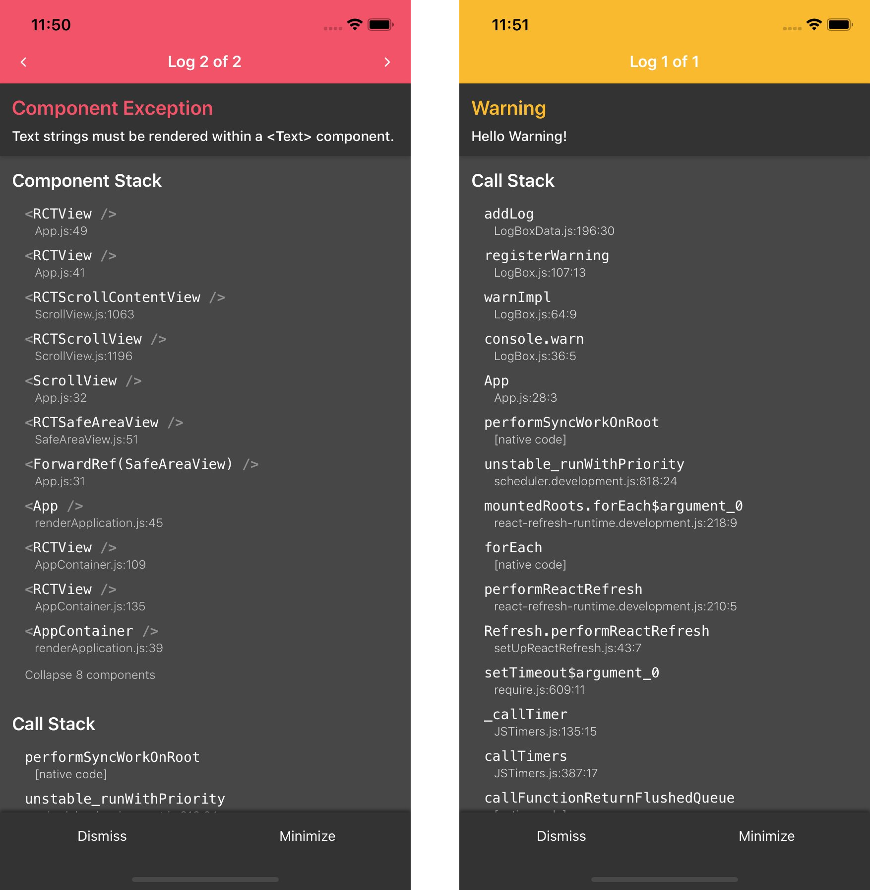

最近、React Native の最新バージョン、0.62 がリリースされました。
React Native 0.62 の新機能については[この記事](https://blog.naturalclar.dev/whats-new-in-react-native-0.62/)にて記載しています。

そして、次のバージョンの Release Candidate である 0.63-rc.0 も新しくリリースされました。
この記事では、次のバージョン、React Native 0.63 で予定されている新機能についてまとめます。

## React Native の Release について

まず、React Native のリリースプロセスについて、少し説明します。
React Native は facebook が開発しているフレームワークですが、リリースプロセスは facebook 社外のコミュニティである React Native Community が行っています。
そのリリースプロセスや、各バージョンでリリースされる機能については、[@react-native-community/releases](https://github.com/react-native-community/releases) のリポジトリに記載されています。

0.63 で予定されている機能は[この issue](https://github.com/react-native-community/releases/issues/186) にて議論されています。

## React Native 0.63 新機能

次のバージョンで予定されていることは以下の通りです。

- LogBox
- Pressable
- PlatformColor API
- DynamicColorIOS API

### LogBox



LogBox は React Native 0.62 で試験的に導入された、新しいエラー画面です。
0.62 ではオプトインでしたが、次のバージョンからは、デフォルトで入るようになります。

今まで使われていた YellowBox は deprecated となり、LogBox API に置き換わります。

### Pressable

Pressable は TouchableOpacity や TouchableHighlight のような新しい　onPress を持つ Component となります。

Pressable は「押された状態」を持っています。子 Component に `pressed` の状態をもたせ、押された状態と押されていない状態で見た目を変更するなどが行えるようになります。

```jsx
import { View, Pressable, Text } from 'react-native'

const PressableExample = () => {
  return (
    <View>
      <Pressable
        onPress={() => {
          console.log('Event fired!')
        }}
      >
        {({ pressed }) => <Text>{pressed ? 'Pressed!' : 'Press Me'}</Text>}
      </Pressable>
    </View>
  )
}
```

### PlatformColor

PlatformColor は端末で設定されている基本色を取得するのに使用されます。

iOS なら UI Standard Colors や UI Element Colors のような [UI Colors](https://developer.apple.com/documentation/uikit/uicolor), Android は [R.attrs](- [Android R.attr](https://developer.android.com/reference/android/R.attr) に設定されている値が取得できます。

それぞれ、DarkMode と LightColor の色が用意されているので、この API を使うだけで、自前で LightMode と DarkMode の色を設定しなくても Dark Mode の対応が行えるようになっています。

```jsx
import { View, Text, StyleSheet, Platform, PlatformColor } from 'react-native'

const PlatformColorExample = () => {
  return (
    <View style={{ backgroundColor: labelColor }}>
      <Text style={styles.label}>Hello World!</Text>
    </View>
  )
}

const styles = StyleSheet.create({
  label: {
    ...Platform.select({
      ios: { color: PlatformColor('labelColor') },
      android: { color: PlatformColor('?attr/colorControlNormal') },
      default: { color: 'black' },
    }),
  },
})
```

### DynamicColorIOS

DynamicColorIOS は Appearance に合わせた色を取得できる iOS専用の新しい API です。

light mode, dark mode でそれぞれ使用する色を設定することができます。

```jsx
const headerTextColor = DynamicColorIOS({
  dark: 'white',
  light: 'black',
})
```

0.62 にて追加された `Appearance` API や、今回追加される `PlatformColor` や `DynamicColorIOS` API の追加によって、Dark Mode 対応はよりやりやすくなるでしょう。

## その他の変更点

### iOS 9 のサポート切り

iOS 9 のサポートが切られます。
iPhone 4 以前の端末の対応が必要な場合、アップデートするのは控える必要があるかも。

### Node.js 8 のサポート切り

先日、EOL を迎えた Node.js 8 のサポートが切られます。
React Native の開発には Node.js 10以降のバージョンを使う必要があります。

### Hermes 0.5.0

[アップデートされた Hermes 0.5.0](https://github.com/facebook/hermes/releases) が入ります。
新しい version では、hermes のサイズが 140MB から 18MB に削減されます。

## リリース予定日

次のバージョンのリリースは5月中旬を予定されています。
