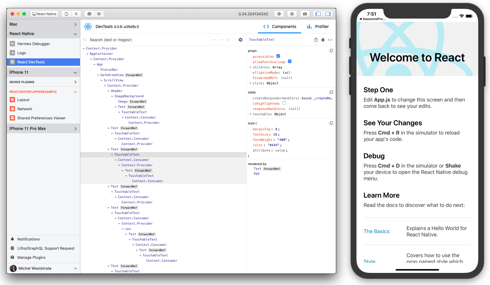

この記事は [React Native Tech Blog #2](https://ducklings.connpass.com/event/169637/) で発表した内容です。

React Native の最新バージョン、0.62 がリリースされました。
マイナーバージョンのアップデートは最後に行われたのが 2019年の9月なので半年ぶりのマイナーバージョンアップとなります。

この記事では 0.62 で新しくなったことについてまとめて行きます。

## Flipper のサポート

0.62は主に React Native のデバッグ周辺が改善されています。その大きな要因として、Flipper のサポートがデフォルトで入るようになりました。

Flipper とは、Facebook が開発しているネイティブアプリ用のデバッグツールです。
この度、React Native でもその恩恵を受けられるようになった他、React Devtools など、React Native ならではのツールも組み込まれるようになりました。
React Devtools は新しい v4 が組み込まれているので、従来の React devtools よりもよりスッキリした見た目で使いやすくなっております。



また、Redux Inspector など、追加のプラグインもいれられるようになっています。

React Native のデバッグにはこれまで React Native Debugger というツールが主に使われていましたが、アプリが複雑になると動作がかなり重くなったりといろんな問題がありました。Flipper はアプリのパフォーマンスをほとんど損なうことなく快適にアプリのデバッグが行えるようになります。

## LogBox

React Native で開発している人なら誰もが一度は「赤い画面」を見たことがあると思います。

React Native 0.62 では試験的に LogBox という新しいエラーメッセージの UI を試せるようになります。


エントリーポイントである `index.js` にて、`unstable_enableLogBox()` を呼び出すことで新しい LogBox の UI が有効化されます。

```js subtitle='Add code above to index.js'
import { unstable_enableLogBox } from 'react-native';

unstable_enableLogBox();
```

## Appearance API


0.62 では端末の Appearance 設定を取得できる Appearance API が追加されました。
端末のテーマ設定に合わせて、アプリのテーマを Dark Mode や Light Mode に変更することができます。

`getColorScheme` 関数を呼び出すことで、端末のテーマ設定を取得できます。

```jsx
import { Appearance } from 'react-native';

const LoginPage = () => {
  const colorScheme = Appearance.getColorScheme();
  if (colorScheme === 'dark') {
    return <DarkContents/>
  }

  return <LightContents/>
}
```

また、午後6時からDarkModeを使う、などの特殊な状況でアプリのテーマ設定を変えたいときに、その変更を Listen するために、`useColorScheme` という custom hooks も提供されています。

```jsx
import { useColorScheme } from 'react-native';

const LoginPage = () => {
  const colorScheme = useColorScheme();
  if (colorScheme === 'dark') {
    return <DarkContents/>
  }

  return <LightContents/>
}
```

自分の場合、テーマ設定に合わせて役割色を取得する `useColorScheme` をラップした CutomHooks を作成して、アプリのダークモード対応に使っています。

```jsx
import { useColorScheme } from 'react-native';

const defaultTheme = {
  textColor: '#222',
  backgroundColor: '#eee',
  primaryColor: '#ff8800'
  white: '#fff',
  black: '#000'
}

const darkTheme = {
  ...default,
  textColor: '#eee',
  backgroundColor: '#222',
}

const useThemeColor = () => {
  const colorScheme = useColorScheme()
  const isDark = colorScheme === 'dark'
  return isDark? darkTheme : defaultTheme
}

```

Appearance については、Polyfill が存在しており、Expo や古い React Native のバージョンでも使用できる、[react-native-appearance](https://github.com/expo/react-native-appearance) というライブラリも存在しています。


## その他

以上の3機能が、今回のアップデートの目玉となっております。

他にも細かい修正があり、時間があるときに追記していきます。
